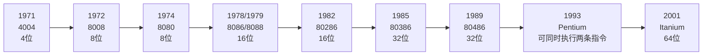
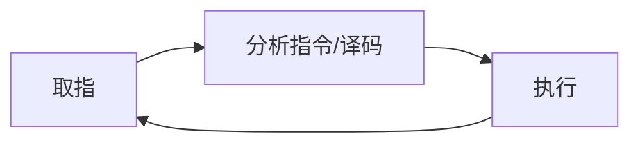
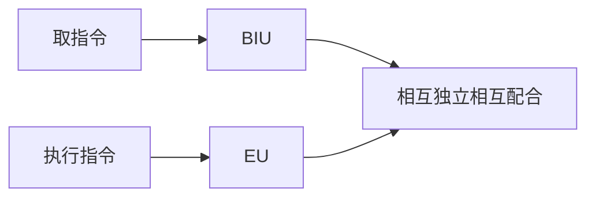
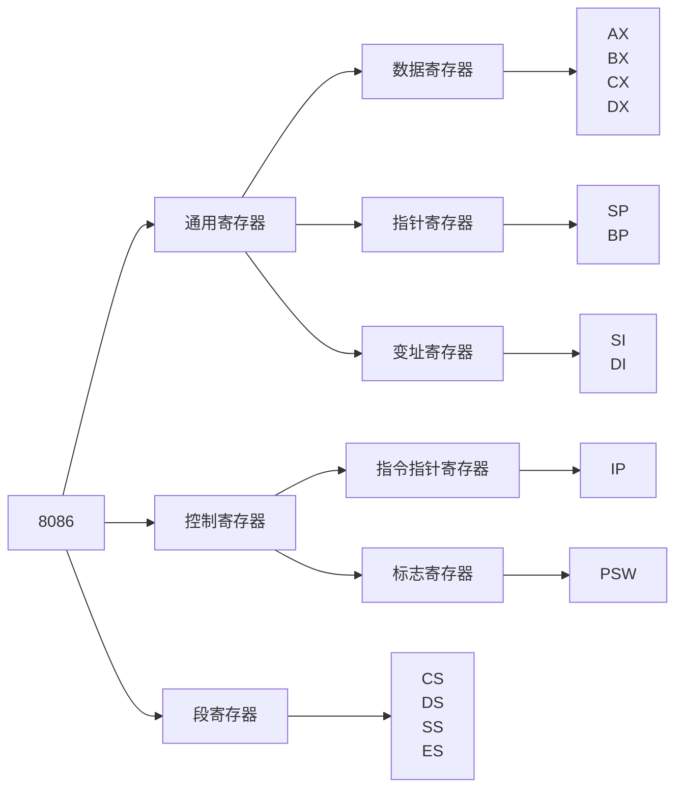

# 1. 微机系统

## 1.1 微机的基本组成

​	微机系统也称PC机，主要由**硬件系统**和**软件系统**组成。

### 1.1.1 基本组成

1. 硬件系统
   - 微型计算机（主机）：微处理器，主存，IO接口，互连网络（总线）等
   - 外围设备：
     - 外部设备：输入输出设备，辅存等
     - 辅助设备：电流电路、时钟电路等
2. 软件系统
   - 系统软件：
     - OS等：对硬件进行管理、协调
     - 编译等：为程序提供开发调试运行等环境
   - 应用软件

### 1.1.2 微机系统的典型结构图

​	如下图所示：

大致包含情况为：

### 1.1.3 微机分层

​							    非标准接口				  标准接口 	标准接口API

## 1.2 微处理器发展

​	**Intel芯片发展**

**本课程教学**：以8086处理器构成系统的设计方法位基础，扩展到32/64位。

## 1.3 微机工作原理

### 1.3.1 存储程序概念

- 程序存储
- 程序控制

### 1.3.2 存储程序控制原理

1. 将微处理器要完成的任务用指令描述，并编成程序
2. 将程序放在存储器中
3. 在控制器控制下，从存储器取指执行
4. 程序执行结果

**流程图如下**：

# 2. 8086/8088cpu

## 2.1 历史

1978年第一款8086CPU，1979年第一款8088CPU.

## 2.2 功能特性（8086）

1. 直接主存寻址能力1MB
2. 存在14个16位寄存器
3. 24种操作数寻址方式
4. 操作数类型：位、字节、字和块
5. 可以实现8位或者16位无符号和有符号二进制和十进制数的计算（包括乘和除）

## 2.3 体系结构

### 2.3.1 EU（Execute Unit）

负责指令的执行（算术、逻辑等等）

### 2.3.2 BIU（Basic Interface Unit)

​	基础接口单元负责存储器和接口的数据交换，主要实现以下几个重要指令：

- 负责从内存取指令并放入指令队列
- 配合EU从指定存储单元或者接口位置获取数据
- 将EU计算得出的结果送到指定存储单元或者IO接口

### 2.3.3 原理

具体细节实现：

- 指令队列总有2+空字节，BIU自动从内存中获取指令，并加入指令队列
- EU从指令队列前部获取指令执行
- 指令如果需要访问内存或者接口，EU委托BIU访问

## 2.4 寄存器结构

​	其中数据寄存器与PSW可以分离成高位和地位H,L

**通用寄存器：**

| Reg   | 特殊用途                                                     |
| ----- | ------------------------------------------------------------ |
| AX,AL | **I/O 指令的数据寄存器**；乘法指令存放**==被乘数==或==积==**(隐含)，除法指令存放被除数或商(隐含) |
| AH    | LAHF指令的目标寄存器(隐含)                                   |
| AL    | 数制转换或十进制运算指令和XLAT指令的累加器(隐含)，8位        |
| BX    | **间接寻址的基址寄存器** XLAT指令的基址寄存器(隐含)          |
| CX    | 串操作和**LOOP指令的计数器**(隐含)                           |
| DX    | 字乘法/除法指令存放**==乘积高16位==**或**被除数高位**或**余数**(隐含) 间接寻址的 **I/O 端口地址** |
| SI    | 串操作的源变址寄存器(隐含)、**间接寻址的变址寄存器**         |
| DI    | 串操作的目标变址寄存器(隐含)、**间接寻址的变址寄存器**       |
| BP    | 对**堆栈区间接寻址的基址指针**                               |
| SP    | **堆栈操作的堆栈顶部指针**                                   |

### 标志寄存器

- 6个状态标志位

  - ==**CF，进位标志**==。本次运算最高位**有进位或借位发生，则CF=1**。**==STC（CLC）指令使CF=1（=0），==CMC指令使之取反。**（用于无符号数）

  - PF，奇偶校验标志：低 8 位有偶数个 1 则 PF = 1

  - **AF：辅助进位标志**

    低 4 位向高四位有进位或借位， AF = 1 （用于 BCD 计算）

  - **ZF：全零标志**

    ==运算结果为 0 时，ZF = 1；==

  - **==SF：符号标志==** 

    运算结果最高位为1，SF = 1 （表示负数）

  - **==OF：溢出标志==**

    运算产生溢出 （两负数相加为正）（有符号数）时， OF =1

- 3 个控制标志位

  - TF：单步标志
  - IF：**中断标志**：IF = 1 允许，**IF=0 禁止 CPU 响应可屏蔽中断** （INTR）
  - DF：方向标志，串操作指令的地址变化方向

## 2.5 主存结构

### 2.5.1 双体结构

​	既可以实现16位存储，又可以实现8位存储

### 2.5.2 分段结构

- 对于代码量和数据量不大的代码，可以将之位于同一段（64KB内），减少指令长度，提高运算速度。

- 形式地址：段寄存器（6832H）：指令寄存器（1280H）->物理地址：68320H+1280H

- 配合使用:

  - CS+IP	->代码段
  - SS+SP/BP	->堆栈段
  - DS（ES）+BX,SI,DI	->数据段

- 特殊内存使用区域：

  - 中断向量区：00000-003FF(1KB)

    ​	256*4B

  - 显示缓冲区：B0000-B0F9F,B8000-BFFFF

  - 启动区：FFFF0-FFFFF

- 8086内存使用示意图

  

  ## 2.6 芯片引脚

  工作在最大模式下的信号

  访问内存，用内存读，内存写信号，20根地址线全用，空间达到1M字节。访问接口时，只用到16根地址线，最大 64K 字节。

  | 名称          | 方向特性 | 功能作用                                                     |
  | ------------- | -------- | ------------------------------------------------------------ |
  | AD15~AD0      | I0,3s    | 16位地址/数据复用引脚(8088的高8位仅是地址A5~A8,没有复用),HOLD期间为三态高阻 |
  | A19/s6~A16/s3 | 0,3s     | 高4位地址/状态复用引脚。访问内存时,A19\~A0构成20位地址,可访问1MB 空间;8086的0端口空间只有64K,访问IO时,A19~A16为“0。作为状态信号S6=0指示CPU连在总线上:S5=IF:S4和S3指示当前使用的段寄存器(表2-3) |
  | BHE/S7        | 0,3S     | 高字节允许/状态复用引脚。在读写操作的T1(输出地址)周期,BHE有效时指示高8位数据总线上的数据有效,ADA=0指示低8位上数据有效,在T2~T4状态,BE/S7输出状态信息,S7在8086中没有定义 |
  | RD            | 0,3s     | 读选通信号,低电平有效。                                      |
  | WR            | 0,3S     | (最小模式时)写选通信号,低电平有效                            |

## 2.6 8086与8088对比

