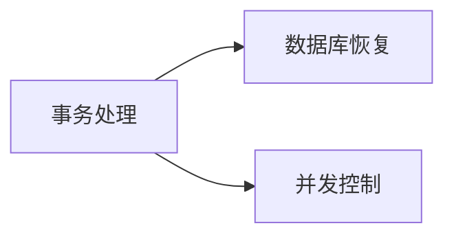

## 数据库设计

数据库设计应该与应用系统设计相结合

- 结构（数据）设计：设计数据库框架和结构
- 行为（处理）设计：设计应用程序、事物处理

### 数据库设计的阶段

1. 需求分析

   - 信息要求、处理要求、安全性与完整性要求
   - 成果：数据流图、数据字典

2. 概念结构设计

   **概念模型**

   - 概念：实体、实体标识符、属性、域（实体的取值范围）、联系

   **抽象机制：**

   分析、聚集、概括

   策略

   - 自顶向下、自底向上、逐步扩张、混合策略

   **视图集成**

   作用：完整描述信息及联系，**解决冲突、消除冗余**

   - 三种冲突

     属性冲突、命名冲突、结构冲突（同一实体拥有不同属性）

3. 逻辑结构设计

4. 物理设计：选择存取方法、设计物理存储结构

5. 数据库实施

6. 运行和维护

在数据库的恢复机制中，建立冗余最常用的技术是：**数据转储、记录日志文件**

## 关系数据库物理结构设计的内容

### 确定数据的存取方法（建立存取路径）

- 存取方法是快速存取数据库中数据的技术
- 常用存取方法：索引方法（B+树索引，哈希索引）以及聚簇方法（一个表只能存取一个聚簇索引）。


## 数据库恢复技术

### 事务的定义

​	**事务**是一系列的数据库操作，是数据库应用程序的基本逻辑单元，是事务处理的基本单位。



	### 定义事务

```sql
Begin TRANSCATION 
	
	
	COMMIT/ROLLBACK;
```

### 事务的特性（ACID）

- 原子性（Atomicity）
- 一致性（Cosistency）
- 隔离性（Isolation）
- 持续性（Durability）

故障恢复技术解决原子性和持续性，并发控制技术解决一致性和隔离性。

### 常见故障种类

1. 事务故障
2. 系统故障
3. 介质故障

​	恢复操作基本原理：**冗余**，即利用存储在别处的冗余数据来重建。

### 建立冗余数据的技术（备份）：

1. 数据转储
   - 静态存储（冷备）
   - 动态存储（热备）
   - 海量转储
   - 增量转储
2. 日志文件

​	先写日志文件，再写数据库。

## 并发控制

保证事务的 **隔离性** 和 **一致性**

并发带来的不一致性问题

1. 丢失修改 （写后写）
2. 不可重复读 （读改读）
3. 读脏数据 （发生了回滚）

### 封锁

**封锁粒度**：封锁对象的大小

基本的封锁类型：**排他锁（X）Xlock**、 **共享锁 （S）Slock**

**三级封锁协议**：

1. 写前加X，事务结束释放		对应事务隔离级别：读未提交
2. 1基础上，读前加S，读完释放					读已提交
3. 1基础上，读前加S，事务结束释放				可串行化	

封锁引发的问题：

- 活锁：采用先来先服务避免
- 死锁：
  - 预防：一次封锁法、顺序封锁法
  - 诊断和解除：超时法、等待图法

### 可串行化调度

当且仅当执行结果与 **某一次** 串行执行这些事务的结果相同

**采用两段锁（2PL）协议，实现并发调度的可串行性**

- 第一阶段：获得封锁、拓展阶段
- 第二阶段：释放封锁、收缩阶段

